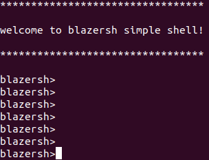
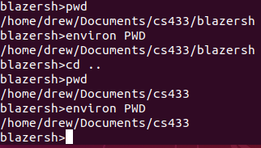
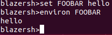
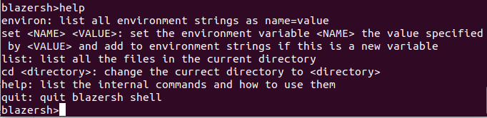
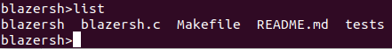
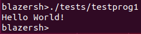
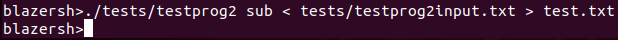

# blazersh

## Description
blazersh is a simple shell interface that executes commands by creating processes and supports I/O redirection.

## Author
Andrew Yarbrough

## Getting started
### Prerequisites and dependencies
gcc
### How to build
Execute the Makefile with the `make` command to compile the program. The blazersh shell is currently one file.
### How to run
The Makefile creates an executable file *blazersh* that can be executed by `./blazersh`.

## Testing
Two test programs are included: testprog1 and testprog2.

testprog1 simply prints to standard output:
> Hello World!

testprog2 is a simple 2-function calculator that accepts one command line argument, either *add* or *sub*, and two integers from standard input.
If the command line argument was *add*, testprog2 adds the two integers from standard input.
Likewise, if the argument was *sub*, testprog2 subtracts the two integers from standard input.
The result of the addition or subtraction is printed to standard output.

Additional tests were performed of the blazersh shell internal commands.

## How to run test programs
To run the test cases, the test programs must be compiled using gcc: e.g. `gcc -o testprog1 testprog1.c`

The test programs can then be executed from the blazersh shell: e.g. `./tests/testprog1`

## Sample test cases
The initialization of the blazersh shell and demonstration of how user is re-prompted when no input is given.

A test example of the internal command `cd` as well as `environ` with an argument.
Notice at first the *pwd* and the PWD environment variable are the same.
After `cd`, the *pwd* and the PWD environment variable change accordingly.

A test example of the internal command `set`. The environment variable *FOOBAR* did not exist.
`set` created the environment variable and set it to the passed argument *hello* as demonstrated by the `environ` command.

A test example of the internal command `help`.

A test example of the internal command `list`.

A test example of running an external command, *testprog1*, which prints to standard output.

A test example of running a command with I/O redirection. In this example, testprog2 is accepting an argument *sub*,
an input file *testprog1input.txt*, and an output file *test.txt*. The contents of *testprog1input.txt* (found in the tests directory):
> 5

> 4

The contents of the resulting *test.txt* file:
> 1

## Contact information
email: ayar434@uab.edu