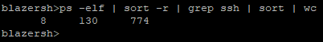
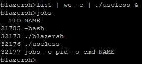

# blazersh

## Description
blazersh is a simple shell interface that executes commands by creating processes. The shell supports I/O redirection, pipes, and forking background processes.

## Author
Andrew Yarbrough

## Getting started
### Prerequisites and dependencies
gcc
### How to build
Execute the Makefile with the `make` command to compile the program. The blazersh shell is one file.
### How to run
The Makefile creates an executable file *blazersh* that can be executed by `./blazersh`.

## Testing
Pipes, I/O redirection, and background processes were tested using commands such as `list`, `sort`, and `wc`.

Additionally, one test program was included: *useless.c*

useless takes a single value from standard input and performs the value cubed number of bitshifts. The purpose of useless was to have a program that runs a significant amount of time so that the difference in running it in the foreground and in the background could be observed.

Additional tests were performed of the blazersh shell internal commands.

## How to run test programs
To run the test cases, the test programs must be compiled using gcc: e.g. `gcc -o useless useless.c`

The test programs can then be executed from the blazersh shell: e.g. `list | wc -c | ./useless`

## Sample test cases
All tests were successfully performed on the Vulcan server at moat.cis.uab.edu.

Pipes are demonstrated first, as pipes are used in future test cases.

blazersh should support up to 49 pipes. 49 is completely arbitrary and can easily be increased; it does _not_ represent a limitation of the code.

Additionally, pipes _do_ support I/O redirection, outputting to a file.

First, a demonstration of a single pipe:

Second, a demonstration of two pipes:

Third, a demonstration of four pipes:

Finally, a demonstration of I/O redirection:

Next, forking background processes is demonstrated. Even piped commands can be run in the background. This test also demonstrates the use of the `jobs` command, listing the processes.

To demonstrate background processes, I piped the result of `list | wc -c`, which resulted in 848, to the _useless_ test program. With 848, _useless_ takes a few seconds to run which was enough time to show the result of running it in the foreground versus the background. As demonstrated, the PID of of _useless_ was 32176. Additionally, the `blazersh>` prompt was immediately given, as the parent did not wait on the child to execute. Children were executed as background processes using `setpgid(0,0)`.

## Sample session
Screenshot of a sample session:

## Contact information
email: ayar434@uab.edu